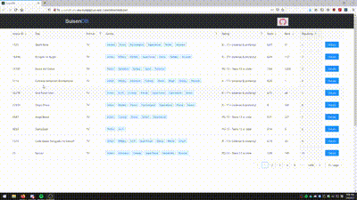

# [SuisenDB](http://suisendb-env.eba-bupgqjyt.us-east-2.elasticbeanstalk.com/)
[](https://github.com/mrsteph3/suisendb/blob/master/LICENSE)
[](http://makeapullrequest.com)


<br />
 
SuisenDB is a tool to help find the anime you want to watch next! 

## Made With
* Frontend: JavaScript with React (AWS Elastic Beanstalk).
* Backend: Java 11 with Spring Boot and Maven (AWS Elastic Beanstalk).
* Database: PostgreSQL which holds all 14000 anime entries in a single table (AWS RDS).

## Installation

### Dependencies
* `JDK 11` You can download it [here](https://adoptopenjdk.net/) or anywhere else on the net.
* `PostgreSQL` You can download PostgreSQL from [here](https://www.postgresql.org/download/).
* `node` and `npm` You can download them [here](https://nodejs.org/en/download/).

### Setup
To setup the project locally to make changes and test, follow the steps below:
* Clone the repository using `git clone https://github.com/mrsteph3/suisendb.git`
* If you haven't already, set up your local PostgreSQL database. A tutorial for this can be found [here](https://www.postgresqltutorial.com/install-postgresql/).
* Open the project folder using your preferred development suite and modify the file at `src/main/resources/application.yml` to include your local database name, user, and password.
* Navigate to `/src/frontend` and do `npm install` to install all dependencies for the frontend.
* You can now start the backend by running main() at `src/main/java/com/mrsteph3/suisen/SuisenApplication.java`.
* Your application should start the API at `localhost:8080`, connect to the local database and migrate using the SQL script at `/src/main/resources/db/V1__CreateAnimeTable.sql`.
* You should now be able to reach the endpoint by navigating to `localhost:8080/api/v1/anime` in a web browser or using an API testing tool such as Postman.
* After you have confirmed that the API is running smoothly, you can start up the development server for the frontend by doing `npm start` at `/src/frontend`.
* Navigate over to `localhost:3000` to see the application in action.

### Building
To build the project to a single .jar file, follow the steps here:
* Add the following lines to your `/src/main/resources/application.yml` file:
```
spring:
    profiles:
        active: prod

server:
    port: 5000
```
Note: You can change the port number to whatever you want. This will be the port that is exposed when the built .jar file is run.
* In a terminal, run `mvn clean install -P prod` in the root directory of the project. This will walk through the Maven lifecycle and produce a .jar file in `/target`.
* To run the .jar file, navigate to `/target` and do `java -jar [name-of-jar-file]`.
* Then you can check out the built project at `localhost:5000` or `localhost:<port>` if you changed the port number in the `application.yml` file.

## Usage

Either clone the project and build locally or navigate to [SuisenDB](http://suisendb-env.eba-bupgqjyt.us-east-2.elasticbeanstalk.com/) to see the project in production. 
You can filter by format, genres, and age rating as well as sort by score, rank, and popularity to find the next anime you want to watch!

## Planned Features

* Implement links to Opening and Closing themes within the details modals for each anime. The database and API already support this feature.
* Add a custom domain and configure HTTPS for secure connections.
* Add a custom favicon. Currently it is the default React favicon.

## Contributing
Pull requests are welcome. For major changes, please open an issue first to discuss what you would like to change.

## Contact
Matthew Stephenson
* Discord: matto#4803

## License
[MIT](https://github.com/mrsteph3/suisendb/blob/master/LICENSE)
